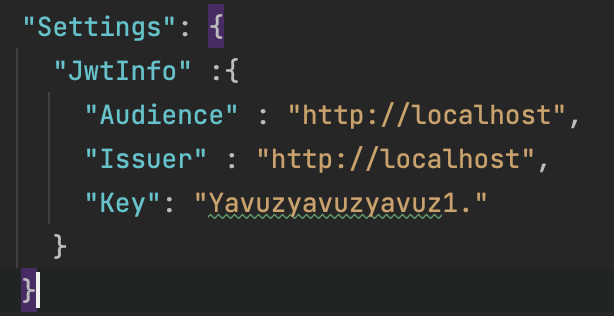
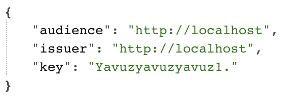

# Option Pattern Examples
Bu projede option pattern mevuzusunu ele alacağız. IOptions hizmeti, seçenekler sınıfını configurasyon bölümüne bağlamak için kullanılır ve Dependency Injection Service Container'a singleton (dependency-injection-lifetime reposu altında anlatmıştım) olarak kaydeder. IOptions<T> olarak geçirilen class da T tipini Value methodu ile alabiliriz.  

## Proje içerisindeki Bakış
Proje kapsamında minimal api kullanılmıştır ve amacım appsetting.json da girilen JwtInfo konfigurasyonunu IOptions<JwtInfo> ile çekip JwtInfo olarak dönmek.
Var sayalım ki Jwt token üretiyoruz ve bu configurasyonları magic string olarak tutmak yerine appsettings.json üzerinden bir Class'a castleyip onuda IOptions ile istediğimiz yerde kullanabilme amaçlanmıştır.

## Sonuçlar
Birinci resim de konfigurasyon olarak girilen bilgilerimiz gösterilmektedir.

İkinci fotoğrafta ise IOptions kullanılarak konfigurasyondaki bilgileri dönen end pointin cevabını görmekteyiz.

